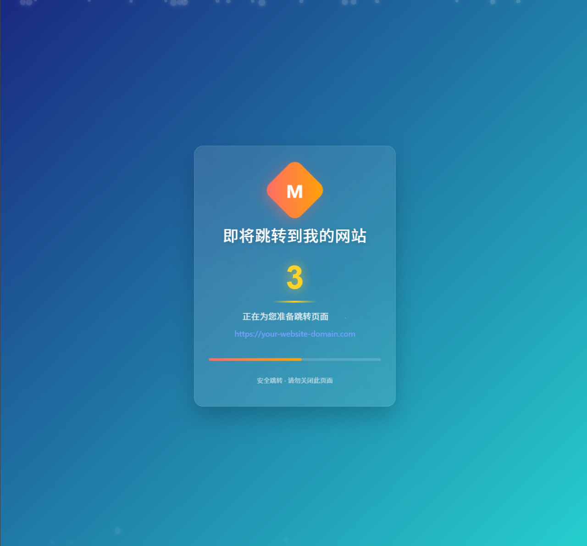

# ⚡️超燃页面跳转倒计时神器

你还在用老掉牙的跳转页面？OUT啦！本工具是为追求极致体验的你量身打造的前端倒计时跳转神器！只需一个 `index.html`，无需后端，开箱即用，炫酷粒子背景+玻璃拟态UI，桌面移动全兼容，谁用谁知道！

> **独家黑科技：自动域名测速，帮你瞬间打开最快的目标站点！**  
> 不管你有多少跳转目标，神器会自动帮你测速，选出最快的那个，丝滑跳转，拒绝卡顿！

## 炫酷特性



- **多域名测速，自动选最快**：内置多目标测速，帮你自动挑选最快的跳转目标，拒绝卡顿！
- **自定义跳转目标与倒计时**：想跳哪就跳哪，倒计时随你定，主宰你的跳转节奏！
- **动态粒子背景**：Canvas 粒子飞舞，科技感爆棚，谁看谁说酷！
- **玻璃拟态UI**：半透明+模糊，潮流感拉满，颜值即正义！
- **大数字倒计时+进度条**：倒计时一目了然，进度条同步燃烧，紧张感拉满！
- **响应式布局**：手机、平板、电脑，屏屏适配，走到哪都能用！
- **零依赖，纯原生**：不带一丝第三方库，轻如鸿毛，快如闪电！
- **隐私无忧**：没有追踪，没有统计，纯净到极致！

## 极速上手

1. 把 `index.html` 拖到你喜欢的地方
2. 用文本编辑器打开，找到这段配置：

    ```js
    const config = {
        // 域名经过简单base64加密
        domains: [
            "aHR0cHM6Ly9kdWppYW8udXV1aXguY29tCg==",
            "aHR0cHM6Ly9iYWlkdS5jb20=",
            "aHR0cHM6Ly8xLjEuMS4x"
        ],
        countdownDuration: 5, // 倒计时秒数
        logoText: "WF",       // 徽标文字
        logoColor: "linear-gradient(45deg, #ff6b6b, #ffa502)", // 徽标渐变色
        pageTitle: "跳转到我的网站" // 页面标题
    };
    ```

3. 想跳哪就改哪，想多快就多快，保存后用浏览器打开，直接起飞！

## 个性化你的神器

- **背景渐变**：改 body 的 `background`，想多炫有多炫
- **粒子特效**：调 JS 粒子数量、速度，或者改 `.particle` 样式
- **倒计时&进度条**：改 `.countdown`、`.progress-bar`，想怎么炫就怎么炫
- **动画细节**：自定义动画速度、透明度、圆角，玩出你的风格

## 部署？小菜一碟！

- **本地用**：直接双击 `index.html`，一秒启动
- **网站集成**：丢服务器、嵌 iframe，随你玩
- **CDN/云部署**：GitHub Pages、Netlify、Vercel，想挂哪挂哪

> 这不是普通的跳转页面，这是属于中二少年的跳转神器！推广、广告、活动跳转，统统不在话下！

TG交流群：[https://t.me/htpnu](https://t.me/htpnu)